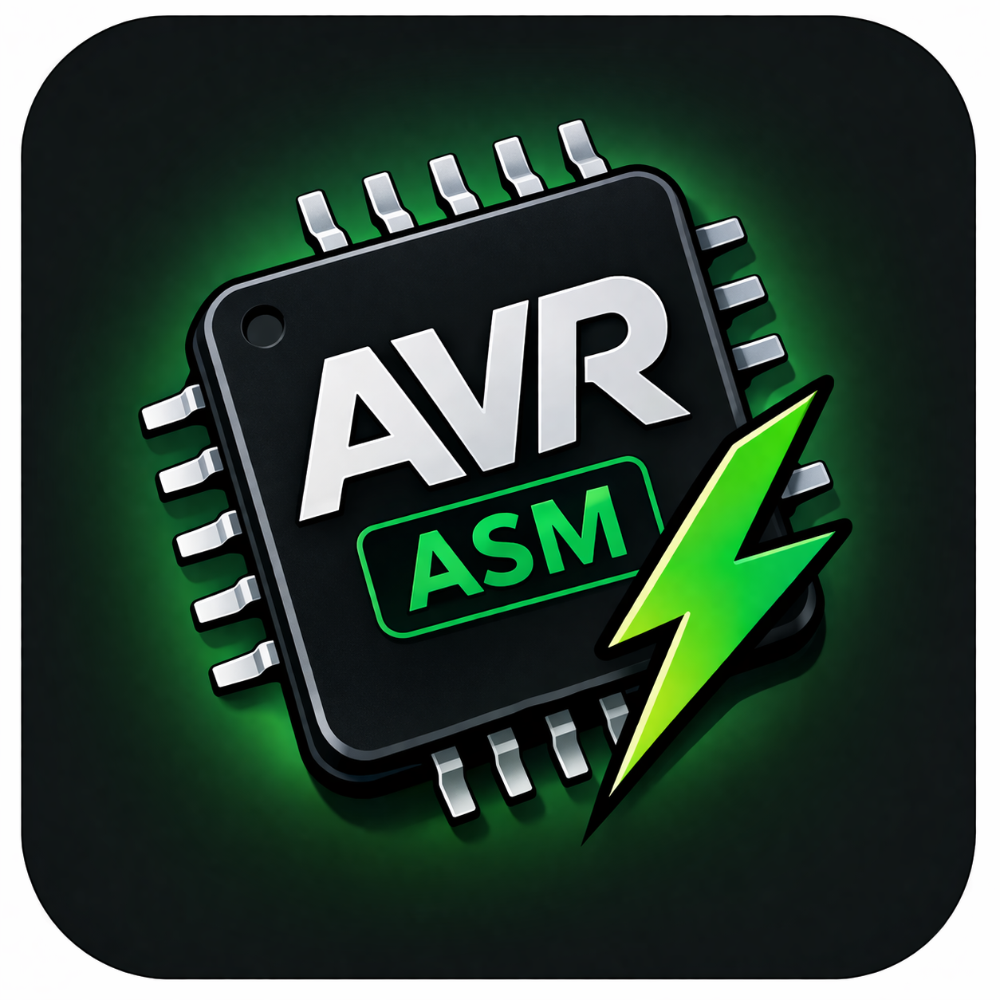

<table width="100%">
  <tr width="100%">
    <td align="left" valign="middle">
      
    </td>
    <td align="center" valign="middle">
    <h3>Assembler - the DNA of Computers</h3>
    </td>
    <td align="right" valign="middle">
      
    </td>
  </tr>
</table>

<h1 align="center">AVR Assembler Toolbox</h1>

<p align="center">
  AVR plugin for assembler code compilation, linking, size reporting, and uploads directly from Visual Studio Code.
</p>

<p align="center">
  
  
  
  
</p>

AVR Assembler Toolbox is a lightweight Visual Studio Code extension for building and uploading AVR assembly (`.s`) projects using the GNU AVR toolchain.

It provides a minimal, fast workflow similar to PlatformIO, but focused on **pure assembler development**.
<p align="center">
  
</p>

## Features

- 🔨 Assemble `.s` → `.o`
- 🔗 Link `.o` → `.elf` (supports `-nostartfiles`)
- 📦 Convert `.elf` → `.hex`
- 📊 Display memory usage (`avr-size`)
- ⬆ Upload firmware via `avrdude`
- 🔌 Auto-detect serial ports
- ⚙ Configurable toolchain paths
- ❗ Clickable compiler errors (Problems panel integration)
- 📌 Status bar buttons for quick actions

### 📁 Supported Files

- AVR assembly source files with extension: `.s`

## Requirements

To use **AVR Assembler Toolbox**, ensure the following tools and environment are available.
This extension also requires Microsoft Serial Monitor. VS Code will prompt to install the missing dependency when needed.

---

### 🧰 AVR Toolchain

This extension depends on the standard AVR GNU toolchain. The following tools must be installed and accessible from your system `PATH`:

- `avr-gcc` – compiler/assembler and linker  
- `avr-objcopy` – converts ELF files to HEX format  
- `avr-size` – displays memory usage  
- `avrdude` – uploads firmware to the target device  

#### Installation (Ubuntu / Debian)

```bash
sudo apt update
sudo apt install gcc-avr binutils-avr avr-libc avrdude
```

#### Installation (Arch Linux)

```bash
sudo pacman -S avr-gcc avr-binutils avr-libc avrdude
```

#### Installation (macOS with Homebrew)

```bash
brew tap osx-cross/avr
brew install avr-gcc avrdude
```

#### Installation (Windows)

- Install **WinAVR**, **AVR-GCC toolchain**, or use **MSYS2**
- Ensure all required tools are added to your system `PATH`

---

### 🖥️ Visual Studio Code

- Visual Studio Code version **1.110.0 or newer**
- This extension must be installed and enabled

---

### 🔌 Hardware (for upload)

To upload firmware using `avrdude`, you will need:

- A supported AVR microcontroller (e.g. ATmega328P)
- A compatible programmer or bootloader (e.g. Arduino bootloader)
- A valid serial/USB port:

| Platform | Example Ports                  |
|----------|-------------------------------|
| Linux    | `/dev/ttyUSB0`, `/dev/ttyACM0` |
| macOS    | `/dev/tty.*`, `/dev/cu.*`      |
| Windows  | `COM3`, `COM4`, etc.           |

The upload port can be configured manually in settings or selected using:

```
AVR: Select Upload Port
```

---

### ⚙️ Optional Configuration

If the AVR toolchain is not available in your system `PATH`, you can configure explicit paths in settings:

```json
{
  "avr-asm-builder.avrGccPath": "/path/to/avr-gcc",
  "avr-asm-builder.avrObjcopyPath": "/path/to/avr-objcopy",
  "avr-asm-builder.avrSizePath": "/path/to/avr-size",
  "avr-asm-builder.avrdudePath": "/path/to/avrdude"
}
```
or using settings as described below.
---


## Extension Settings

This extension contributes the following settings under the `avr-asm-builder` namespace.

You can configure them via:

- **Settings UI** → search for `AVR ASM Builder`
- or directly in `settings.json`

---

### ⚙️ Available Settings

#### 🔧 Toolchain

```json
"avr-asm-builder.avrGccPath": "avr-gcc"
```
Path or command name for `avr-gcc`.

```json
"avr-asm-builder.avrObjcopyPath": "avr-objcopy"
```
Path or command name for `avr-objcopy`.

```json
"avr-asm-builder.avrSizePath": "avr-size"
```
Path or command name for `avr-size`.

```json
"avr-asm-builder.avrdudePath": "avrdude"
```
Path or command name for `avrdude`.

---

#### 🧠 Target Configuration

```json
"avr-asm-builder.mcu": "atmega328p"
```
Target MCU passed to:
- `avr-gcc` via `-mmcu`
- `avrdude` via `-p`

```json
"avr-asm-builder.useNoStartFiles": true
```
If enabled, uses `-nostartfiles` during linking (recommended for pure assembly projects).

---

#### 📁 Build Configuration

```json
"avr-asm-builder.outputDirectory": "build"
```
Directory where build artifacts are stored (`.o`, `.elf`, `.hex`).

---

#### 🔌 Upload Configuration

```json
"avr-asm-builder.avrdudeProgrammer": "arduino"
```
Programmer passed to `avrdude` via `-c`.

```json
"avr-asm-builder.avrdudePort": "/dev/ttyUSB0"
```
Serial/USB port used for uploading firmware.

You can:
- set it manually
- or use command:

```
AVR: Select Upload Port
```

```json
"avr-asm-builder.avrdudeBaud": 115200
```
Baud rate used for uploading via `avrdude`.

---

### 📝 Example Configuration

```json
{
  "avr-asm-builder.mcu": "atmega328p",
  "avr-asm-builder.avrGccPath": "/usr/bin/avr-gcc",
  "avr-asm-builder.avrObjcopyPath": "/usr/bin/avr-objcopy",
  "avr-asm-builder.avrSizePath": "/usr/bin/avr-size",
  "avr-asm-builder.avrdudePath": "/usr/bin/avrdude",
  "avr-asm-builder.avrdudePort": "/dev/ttyACM0",
  "avr-asm-builder.avrdudeProgrammer": "arduino",
  "avr-asm-builder.avrdudeBaud": 115200,
  "avr-asm-builder.outputDirectory": "build",
  "avr-asm-builder.useNoStartFiles": true
}
```

---

### 💡 Notes

- All tool paths can be either:
  - command names (if available in `PATH`)
  - or absolute paths
- Settings can be defined:
  - globally (user settings)
  - per project (`.vscode/settings.json`)
- Changes take effect immediately (no restart required)

## Example

Below is a minimal AVR assembly example that blinks the built-in LED on **Arduino Uno (ATmega328P, PB5 / pin 13)**.

Create a file named `main.s`:

```asm
.org 0x0000
rjmp RESET

DDRB  =0x04
PORTB =0x05

RESET:
    ldi r16, 1 << 5        ; Set bit 5
    out DDRB, r16          ; Set PB5 as output

LOOP:
    sbi PORTB, 5           ; Turn LED on
    rcall delay
    cbi PORTB, 5           ; Turn LED off
    rcall delay
    rjmp LOOP

delay:
    ldi r20, 60     ; Outer loop
outer_loop:
    ldi r18, 250    ; Mid loop
mid_loop:
    ldi r19, 250    ; Inner loop
inner_loop:
    dec r19
    brne inner_loop
    dec r18
    brne mid_loop
    dec r20
    brne outer_loop
    ret
```

### How to run

1. Open `main.s` in Visual Studio Code  
2. Click **AVR Build** in the status bar or run:
   ```text
   AVR: Build Current .s File
   ```
3. Upload to your device:
   ```text
   AVR: Upload Current HEX
   ```

### Notes

- The example configures **PB5 (Arduino pin 13)** as output.
- A simple software delay loop is used for timing.
- Make sure your settings match your hardware:
  - `avr-asm-builder.mcu`
  - `avr-asm-builder.avrdudePort`

## Known Issues

Linking errors (e.g. unknown identifier such as label) do not guide you to the source file when clicking an error in the output console.

## Release Notes

### 0.1.0

Initial release for public

### 0.1.9

RC-1 version with sidebar, icons, documentation and settings

### 0.3.0

Added Serial Monitor

### 0.3.8

Serial Monitor re-use logic updated

### 0.4.1

Re-organised configuration logic and optimised source files.

## About the project:


The MultiASM project has been co-funded by the European Union. Views and opinions expressed are however those of the author or authors only and do not necessarily reflect those of the European Union or the Foundation for the Development of the Education System. Neither the European Union nor the entity providing the grant can be held responsible for them.

[MultiASM website](https://multiasm.eu)

KA220-HED – Cooperation partnerships in higher education

Project ID: 2023-1-PL01-KA220-HED-000152401

Project implementation period: from 2023.12.01 to 2026.11.30 (36m)

**Enjoy!**
